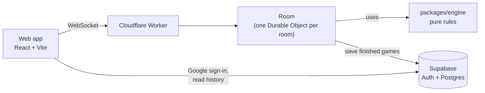

# Cardly

**Portuguese card games online, with friends, in private rooms.**

Cardly brings two classic Portuguese table games to the browser: **Sueca** (4 players, two teams) and **Gringo** (3 to 6 players). One player creates a room, shares a six-character code or link, and everyone plays from their own phone or computer. No account needed; signing in with Google keeps a history of your games.

The interface is in Portuguese (Portugal) and designed mobile-first, with the look of a café card table.

---

## Contents

- [Features](#features)
- [Tech stack](#tech-stack)
- [Architecture](#architecture)
- [Getting started](#getting-started)
- [Configuration](#configuration)
- [Testing](#testing)
- [Deployment](#deployment)
- [Security](#security)
- [Project structure](#project-structure)
- [Game rules](#game-rules)

---

## Features

**Rooms and lobby**
- Private rooms with a shareable code and invite link (`/sala/<code>`).
- The host picks the game and its settings; settings lock when the game starts.
- Seat choice, ready check, host can remove players before the start.

**Play**
- Full rules for Sueca and Gringo, enforced by the server. Illegal cards cannot be played.
- Server-side turn timers with automatic play on timeout, so a table never stalls.
- Leaving mid-game pauses the table; the host replaces the empty seat with a bot or ends the game.
- Reconnection: a refresh or dropped connection returns the player to the same seat and hand.

**Accounts and history**
- Optional Google sign-in. Guests play with a nickname only.
- Finished Sueca matches and Gringo rounds are saved for signed-in players and listed on the history page (`/historico`).

**Cost**
- Runs entirely on free tiers: Cloudflare Workers, Vercel and Supabase. No credit card required.

## Tech stack

| Layer | Technology |
|---|---|
| Game rules | TypeScript, pure functions, no I/O (`packages/engine`) |
| Shared protocol | TypeScript message and error types (`packages/protocol`) |
| Game server | Cloudflare Workers + Durable Objects, [`partyserver`](https://github.com/cloudflare/partykit) WebSockets |
| Web client | React 19, Vite, [`partysocket`](https://github.com/cloudflare/partykit) (auto-reconnect) |
| Auth and history | Supabase Auth (Google) and Postgres with row level security |
| Tests | Vitest |
| Hosting | Cloudflare (server), Vercel (web) |

## Architecture



- **The server is authoritative.** It shuffles, deals, validates every action and holds all game state. Clients only send intentions and render what they receive.
- **One Durable Object per room.** It processes one message at a time, so simultaneous actions (two players racing to match the same Gringo card) resolve in arrival order. State is written to Durable Object storage after every change and survives restarts.
- **Per-player views.** Every update is built for its recipient: public table state plus that player's own cards. Other hands, the draw pile and reconnect tokens never leave the server. In Gringo, a card a player may look at is sent once and shown briefly, so players must remember their cards.
- **Stale actions are rejected.** Sueca actions carry the state version; time-critical Gringo actions name the discard they answer.
- **Timers live on the server** (Durable Object alarms): turn timeouts, bot moves, the Gringo draw lock after each discard, and the pause before the next hand.
- **Free-tier friendly.** After 20 minutes without activity a room closes its connections so it stops using compute; players tap "Voltar à mesa" to return. Idle rooms are deleted after 24 hours.
- **History.** A signed-in player's Supabase token is verified by the Worker when they join. When a game ends with a signed-in player at the table, the Worker saves it through a database function only the server can call.

The full specification, including every rule decision, is in [docs/SPEC.md](docs/SPEC.md).

## Getting started

### Requirements

- Node.js 24 or later
- npm 12 or later

### Install

```sh
npm install
```

### Run locally

Start the game server (http://127.0.0.1:8787):

```sh
npm run dev -w @cardly/server
```

In a second terminal, start the web app (http://localhost:5173):

```sh
cp apps/web/.env.example apps/web/.env.local   # first time only
npm run dev -w @cardly/web
```

Open http://localhost:5173, create a room and open the invite link in other browsers or private windows. Tabs of the same browser share storage and count as the same player.

Login and history are optional locally. Without Supabase settings the app runs in guest-only mode. To enable them, see [Supabase setup](#supabase-setup).

> Restart the game server after changing anything in `packages/`.

## Configuration

| File | Variable | Purpose |
|---|---|---|
| `apps/web/.env.local` | `VITE_SERVER_URL` | Game server origin, e.g. `https://cardly-server.<account>.workers.dev` |
| `apps/web/.env.local` | `VITE_SUPABASE_URL` | Supabase project URL. Leave empty for guest-only mode |
| `apps/web/.env.local` | `VITE_SUPABASE_ANON_KEY` | Supabase publishable (anon) key |
| `apps/server/wrangler.jsonc` | `ALLOWED_ORIGINS` | Comma-separated web origins allowed to create and open rooms |
| `apps/server/wrangler.jsonc` | `SUPABASE_URL` | Supabase project URL, used to verify sign-ins and save history |
| `apps/server/.dev.vars` (local) or `wrangler secret put` (production) | `SUPABASE_SECRET_KEY` | Supabase secret key. Server only. Without it, history is not saved |

Templates: `apps/web/.env.example` and `apps/server/.dev.vars.example`. The real files are ignored by git.

### Supabase setup

1. Create a free Supabase project.
2. In Google Cloud, create an OAuth client (Web application) with the authorized redirect URI `https://<project-ref>.supabase.co/auth/v1/callback`.
3. In Supabase, go to **Authentication > Providers > Google**, enable it and paste the client ID and secret.
4. In **Authentication > URL Configuration**, set the Site URL to the web origin (`http://localhost:5173` locally) and add the production origin to the Redirect URLs.
5. In the **SQL Editor**, run `supabase/migrations/schema.sql`, then `supabase/tests/rls.sql`. The test rolls back its data and ends with `RLS OK`.
6. Fill in the variables from the table above.

## Testing

```sh
npm test            # engine and server tests
npm run typecheck   # all packages
```

| Test file | Covers |
|---|---|
| `packages/engine/src/sueca/sueca.test.ts` | Deck, card ranking, points, trump, following suit, trick winner, scoring thresholds, capote, bandeira, 60–60 rules, match end, full random matches, hidden-card leak checks |
| `packages/engine/src/gringo/gringo.test.ts` | Gringo rules, abilities, matching, round end, what each player may see |
| `apps/server/src/room.test.ts` | Lobby, host rules, start locking, stale actions, reconnection, timers, message parsing |
| `apps/server/src/gringo-room.test.ts` | Gringo lobby, match races, timers, bots, ending between rounds |
| `apps/server/src/history.test.ts` | History records for finished Sueca matches and Gringo rounds |
| `apps/server/src/gate.test.ts` | Which requests may reach a room |
| `supabase/tests/rls.sql` | Row level security, run in the Supabase SQL Editor |

## Deployment

All three services have free plans that need no credit card.

### Game server (Cloudflare Workers)

1. Create a Cloudflare account.
2. In `apps/server/wrangler.jsonc`, set `ALLOWED_ORIGINS` to the production web origin, e.g. `https://cardly.vercel.app`.
3. Deploy and add the Supabase secret key:

   ```sh
   cd apps/server
   npx wrangler login
   npx wrangler deploy
   npx wrangler secret put SUPABASE_SECRET_KEY
   ```

4. Note the `*.workers.dev` URL printed by the deploy.

After the first manual deploy, GitHub Actions (`.github/workflows/ci.yml`) typechecks and tests every push and pull request, and redeploys the game server on every push to `main`. It needs two repository secrets (**Settings > Secrets and variables > Actions**):

- `CLOUDFLARE_API_TOKEN`: a Cloudflare API token from the "Edit Cloudflare Workers" template.
- `CLOUDFLARE_ACCOUNT_ID`: the account ID shown by `npx wrangler whoami`.

### Web app (Vercel)

1. Import the repository in Vercel.
2. Settings: root directory `apps/web`, framework Vite, build command `npm run build`, output `dist`. Enable "Include files outside the root directory" so the workspace packages resolve.
3. Environment variables: `VITE_SERVER_URL` (the Worker URL), `VITE_SUPABASE_URL`, `VITE_SUPABASE_ANON_KEY`.
4. Once the repository is connected, Vercel deploys every push to `main` and gives each pull request a preview URL.
5. `apps/web/vercel.json` sends every path to `index.html` (so `/sala/<code>` links work) and sets the security headers.

### After the first deploy

- Add the production web origin to the Supabase Redirect URLs.
- If the Worker is not on `*.workers.dev`, or the Supabase project changes, update `connect-src` in the Content Security Policy in `apps/web/vercel.json`.

## Security

- **Server-side validation.** Every action is checked against the rules and the game state on the server. Input messages are shape-checked and size-limited.
- **No hidden information on the client.** Each player receives only what they may see.
- **Rate limits.** 15 messages per second per connection, 16 connections per room, 10 new rooms per minute per IP address.
- **Room access.** Only WebSocket connections from the allowed web origins, to a well-formed room code, reach a room. All other requests are refused.
- **Authentication.** Supabase session tokens are verified against the project's public keys (issuer and audience checked).
- **Database.** Row level security: players read only the games they took part in. Clients cannot write; only the server's secret key can save a game, through one database function.
- **Web headers.** Strict Content Security Policy, `frame-ancestors 'none'`, HSTS, `nosniff`, referrer and permissions policies.
- **Keep-alive.** A free Supabase project pauses after a week without activity. The Worker's cron trigger (Sundays and Wednesdays, 06:00 UTC) runs one small query to prevent that.
- **Secrets.** Kept out of git (`.env.local`, `.dev.vars`); production secrets are stored with `wrangler secret`.

## Project structure

```
cardly/
├── apps/
│   ├── server/          Cloudflare Worker: rooms, timers, history writes
│   └── web/             React client (Portuguese UI)
├── packages/
│   ├── engine/          Sueca and Gringo rules, per-player views
│   └── protocol/        Messages, error codes and constants shared by server and web
├── supabase/
│   ├── migrations/      Database schema: profiles, matches, row level security
│   └── tests/           Row level security checks
└── docs/
    ├── SPEC.md          Specification, decisions and phase plan
    └── rules/           Full rules of both games
```

## Game rules

### Sueca

Four players in two teams, partners sitting opposite. 40 cards, 10 each. Card order A > 7 > K > J > Q > 6 > 5 > 4 > 3 > 2; points A 11, 7 10, K 4, J 3, Q 2 (120 in total). The last card dealt sets the trump suit. Players must follow suit when they can; otherwise any card, trump optional. A hand with 61–90 points wins 1 risco, 91–119 wins 2, all 120 (capote) wins 4.

The host sets the match target (3, 4 or 7 riscos), the 60–60 tie rule, the capote rule and the turn timer.

Full rules: [docs/rules/sueca.md](docs/rules/sueca.md).

### Gringo

Three to six players. 52 cards plus 2 Jokers; each player has 4 face-down cards and looks at 2 of them at the start. On your turn, draw a card, then discard it or swap it with one of yours. Anyone may match the top discard at any moment; a wrong match costs a penalty card. Queens, Jacks and black Kings give abilities when discarded. Call "Gringo" when you think your total is lowest: everyone else gets one more turn, then all cards are revealed. Lowest total wins (A = 1, 2–10 face value, J/Q/black K = 13, red K = −2, Joker = 0).

Full rules: [docs/rules/gringo.md](docs/rules/gringo.md). Implementation decisions: [docs/SPEC.md](docs/SPEC.md), section 6.
